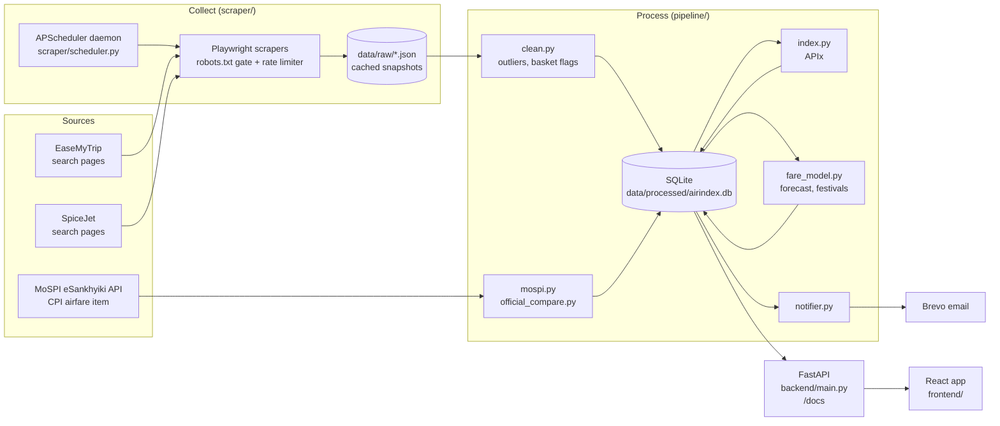

# AIRINDEX INDIA — Real-time Airfare Price Index (APIx)

**Smart India Hackathon 2026 · MoSPI problem statement 26056.**

AIRINDEX INDIA measures what domestic flights in India cost, **every day**. Each morning it
looks up nonstop economy fares on public booking sites for six busy routes, and turns them
into one number: the **Airfare Price Index (APIx)**, which is 100 on our first day of
checking. It sits on top of the government's official monthly airfare index (MoSPI CPI,
2014 onwards) and adds:

* **for travellers:** the cheapest route today, the best time to book each route, how much
  festivals push prices up, and free email alerts when a route gets cheaper than usual;
* **for statisticians (NSO / RBI):** an open, documented API (`/docs`) with the daily index,
  the underlying cleaned fares, and a side-by-side comparison with the official CPI series.

> **Not an official statistic.** This is a hackathon project. Where data is thin, the app
> says so instead of filling the gap (see [Honesty notes](#honesty-notes)).

---

## Architecture



The app reads only from the SQLite database, which is built from the JSON snapshots in
`data/raw/`. **Nothing depends on a live scrape at request time**, so a site blocking us
or a failed run just leaves yesterday's data in place.

| Layer | Where | What |
|---|---|---|
| Scrape | `scraper/` | Playwright scrapers, one file per source; robots.txt checked, rate-limited; every run cached as JSON in `data/raw/` |
| Schedule | `scraper/scheduler.py` | APScheduler with a persistent job store, retries and missed-run catch-up |
| Clean | `pipeline/clean.py` | raw JSON → `fares` table, outlier and basket flags |
| Index | `pipeline/index.py` | daily **APIx**, route × booking-window basket, traffic-weighted, base day = 100 |
| Official data | `pipeline/mospi.py`, `pipeline/official_compare.py` | MoSPI CPI airfare series; link, overlap stats and seasonal profile vs APIx |
| Forecast | `pipeline/trend_forecast.py` | straight-line trend through the last 10 days, 3–7 days ahead, with a 95 % band |
| Predict | `pipeline/fare_model.py` | gradient-boosting fare model behind `/predict` |
| Festivals | `pipeline/festivals.py` | festival calendar → festival vs ordinary-day price jump per route |
| Alerts | `pipeline/notifier.py` | saved routes > 15 % below their 14-day usual price → email via Brevo, 24 h cooldown |
| API | `backend/main.py` | FastAPI + Swagger (`/docs`) |
| UI | `frontend/` | React + TypeScript + Tailwind + Recharts, six pages |

---

## Setup

Needs **Python 3.11+** and **Node 18+**. Commands are for Windows (PowerShell); on
macOS/Linux use `source .venv/bin/activate` and forward slashes.

```powershell
# 1. Python environment
python -m venv .venv
.venv\Scripts\activate
pip install -r backend\requirements.txt

# 2. The browser the scrapers drive — REQUIRED, pip does not install it
python -m playwright install chromium

# 3. Secrets: copy the template and fill in your Brevo key
copy .env.example .env
#    then edit .env:   BREVO_API_KEY=xkeysib-...

# 4. Build the database from the snapshots in data/raw/, then fetch official CPI data
python -m pipeline.run_all --rebuild
python -m pipeline.mospi

# 5. Frontend dependencies
cd frontend; npm install; cd ..

# 6. Keep collecting prices every day (run once; see "Scheduler" below)
powershell -ExecutionPolicy Bypass -File scripts\install_scheduler_task.ps1
```

> **Playwright browser missing?** If a scrape fails with *"Executable doesn't exist"* or
> *"Looks like Playwright was just installed or updated"*, run
> `python -m playwright install chromium` again. Playwright keeps its browsers in a per-user
> cache (`%USERPROFILE%\AppData\Local\ms-playwright`) tied to the package version, so any
> Playwright upgrade — including one pulled in by `pip install -r backend\requirements.txt` —
> needs the matching browser re-downloaded. Only scraping needs it; the API and the website
> don't.

### `.env`

All secrets live in `.env` (git-ignored) and are read with `python-dotenv`. Nothing is
hard-coded. See `.env.example`:

| Variable | Needed? | What |
|---|---|---|
| `BREVO_API_KEY` | for emails | Brevo transactional email key. Without it, alerts are still evaluated and logged, just not sent. |
| `ALERT_FROM_EMAIL`, `ALERT_FROM_NAME` | optional | sender identity for alert emails |
| `CORS_ORIGINS` | optional | comma-separated origins allowed to call the API |
| `DEMO_MODE` | optional | `0` (default) or `1` — see [Demo mode](#demo-mode) |

---

## Running it

```powershell
# API  → http://localhost:8000   (Swagger: http://localhost:8000/docs)
.venv\Scripts\python -m uvicorn backend.main:app --reload --reload-dir backend --reload-dir pipeline --port 8000

# Website → http://localhost:5173
cd frontend; npm run dev
```

Or with Docker (API + website; the scheduler is opt-in, see below):

```powershell
docker compose up -d backend frontend
```

The website opens on a landing page, then has six pages, each with its own URL (deep
links and the back button work):

| Page | URL | What's on it |
|---|---|---|
| Landing | `/` | full-screen hero video, live numbers, how it works, why it matters, the team |
| Home | `/home` | today's index, a plain-English summary, and quick answers: cheapest route today, best time to book, next festival price jump |
| Routes | `/routes?from=DEL&to=BOM` | city search, best time to book, prices by booking time, the price map, and the individual flights found |
| Festivals | `/festivals` | how much fares jump around each festival, per route |
| Official data | `/official` | MoSPI's monthly airfare index since 2014, and how APIx lines up with it |
| My alerts | `/alerts` | from / to / email form; your saved alerts with delete |
| How it works | `/about` | method, sources and a glossary in plain English |

### Refreshing data by hand

```powershell
python -m scraper.run                                   # all sources, all routes, standard offsets
python -m scraper.run --source easemytrip --routes DEL-BOM --offsets 2,10   # quick test
python -m scraper.run --dates 2026-11-07,2026-10-28     # explicit travel dates (festival vs control)
python -m pipeline.run_all                              # clean → index → model → festivals → alerts
python -m pipeline.mospi --years 2025 2026              # refresh official CPI for some years
```

### Scheduler

The index only gains history in wall-clock time, so collection has to happen on its own.
`scraper.scheduler` is an APScheduler daemon with a persistent job store
(`data/processed/jobs.db`):

| Job | When (IST) |
|---|---|
| scrape each source | daily 06:00, sources staggered 30 min apart |
| clean + index + model | daily 08:00 |
| low-fare alerts | daily 09:00 |
| official CPI refresh | 15th of each month, 07:00 |

**Start it automatically on Windows** (run once, from the repo root):

```powershell
powershell -ExecutionPolicy Bypass -File scripts\install_scheduler_task.ps1
```

That registers a Task Scheduler entry that starts the scheduler at logon and again at
05:55 daily. It overrides three Windows defaults that would otherwise quietly stop
collection on a laptop: tasks not starting on battery, tasks being stopped when
unplugged, and a 72-hour execution limit. Remove it with `-Uninstall`.

```powershell
.venv\Scripts\python -m scraper.scheduler            # run in the foreground (Ctrl-C to stop)
.venv\Scripts\python -m scraper.scheduler --once     # one full cycle now, then exit
.venv\Scripts\python -m scraper.scheduler --list     # jobs and next run times
.venv\Scripts\python -m scraper.scheduler --health   # per-source health
```

Missed days: if the laptop is closed at 06:00, that day's scrape still runs whenever the
machine is on later that day (20-hour misfire grace, coalesced to one run). Only a day
spent entirely offline is skipped — the index can't observe a day it wasn't running for.
A lock file stops two schedulers running at once, so starting one by hand while the task
is up is a harmless no-op.

Docker alternative (only while Docker Desktop is running — pick **one** of the two, never
both, or every site gets scraped twice): `docker compose --profile scheduler up -d scheduler`.

Structured JSON logs go to `data/logs/scheduler.jsonl` (rotated at 5 MB × 5).
`GET /health` reports scrape age and per-source status, and marks a source `stale` if it
hasn't succeeded in 48 hours.

### Tests

```powershell
.venv\Scripts\python -m pytest -q                  # full suite
.venv\Scripts\python -m pytest -q -m "not slow"    # skip the model-training test
cd frontend; npx tsc --noEmit                       # type-check the website
```

Every test runs against a temporary SQLite file (the live and demo databases are never
touched), and a guard fails any test that opens a network connection. MoSPI tests replay
recorded responses from `tests/fixtures/mospi/`; Brevo is mocked.

---

## Demo mode

A fresh install has very little history (real days accrue one per day). For presentations:

```powershell
python scripts\build_demo_db.py                 # writes data/processed/airindex_demo.db
$env:DEMO_MODE=1; .venv\Scripts\python -m uvicorn backend.main:app --port 8000
# or set DEMO_MODE=1 in .env and restart the API / backend container
```

* `DEMO_MODE` is **off by default**.
* Demo data lives in a **separate database file** (`airindex_demo.db`) built from the seeded
  fixtures in `tests/fixtures/`, plus a copy of the real official CPI table. The live
  database is never written to. This is isolation, not filtering, so no missed `WHERE`
  clause can leak seeded fares into real output. The API refuses to start if the mode and
  the database file don't match.
* The website shows a **"Demo data — not real fares"** badge on every page, at every screen
  size, and `/meta` reports `data_mode: "demo"`.

---

## How APIx is calculated

### Basket

Six routes, weighted by approximate DGCA domestic traffic share (normalised to 1):

| Route | Weight | Route | Weight |
|---|---|---|---|
| Delhi → Mumbai (DEL-BOM) | 0.26 | Delhi → Kolkata (DEL-CCU) | 0.13 |
| Delhi → Bengaluru (DEL-BLR) | 0.20 | Chennai → Delhi (MAA-DEL) | 0.12 |
| Mumbai → Bengaluru (BOM-BLR) | 0.18 | Bengaluru → Hyderabad (BLR-HYD) | 0.11 |

Each route is observed at a **fixed booking profile**: flights exactly 2, 5, 10, 21 and 45
days ahead, grouped into windows `0-3`, `4-7`, `8-14`, `15-30`, `31-60` days. This mirrors
DGCA's Tariff Monitoring Unit, which checks fares 30/15/7/3/2/1 days ahead. Only
**nonstop economy** fares enter the index, so like is always compared with like.

### Formula

```
cell price relative   rel[D][r][w] = mean_fare[D][r][w] / mean_fare[BASE][r][w]
route relative        rel[D][r]    = mean over windows w observed on D
APIx[D]               = 100 × Σ_r W_r · rel[D][r]  /  Σ_r W_r        (routes observed on D)
```

A Laspeyres-style fixed basket with base = first captured day. `coverage` is the share of
basket weight actually observed that day; routes or windows missing on a day are
renormalised out, never imputed.

### Cleaning

* Sold-out / placeholder rows (no total, < ₹500, > ₹60,000) are dropped.
* Outliers: within each (route, travel date, stops) group, fares above 3 × the group median
  are flagged `is_outlier = 1`. They stay in `/fares/raw` but are excluded from the index
  and the model.
* `in_basket = 1` only for fares scraped at the standard offsets; extra festival/control
  scrapes feed the model and festival analysis but not the index.

### Best time to book

For each route, `GET /routes/{route}/best-time` averages fares per booking window across
**every day** of prices we hold (weighted by the number of fares), keeps windows with at
least 20 fares, and names the cheapest: *"Cheapest to book about 10 days before travel
(avg ₹6,953)"*. With fewer than two such windows it says there isn't enough data yet.

### Official comparison

APIx is rebased onto the CPI level at a link month. Correlation, MAE and MAPE need at least
3 overlapping months; until then `/official/compare` returns `pending_overlap`, and the page
compares today's move with the CPI's usual pattern for this month (mean month-over-month
change per calendar month, 2014 onwards).

### Other models

* **Forecast:** ordinary least squares through the last 10 index values, extrapolated 3–7
  days, band = 1.96 × residual SE × √h. Needs 10 real days.
* **Fare model:** `GradientBoostingRegressor` on `log(total_fare)` with route, carrier, days
  to departure, day of week, weekend, festival season and booking window. Retrained every
  cycle; hold-out MAE / MAPE / R² at `/model/info`.
* **Festival jump:** fares are tagged by travel date against `pipeline/festivals.py`; for each
  (festival, route) the festival mean is compared with the ordinary-day mean for the same
  booking-window mix (`basis = "same window"`), falling back to the route's overall mean
  and saying so (`basis = "route overall"`).
* **Alerts:** `today` = mean basket fare on the latest scrape day, `usual` = mean over the
  previous 14 scrape days; cheap if `today < 0.85 × usual`. One email per route per 24 h.
  Alerts are keyed by a random `browser_id` in `localStorage` — no accounts — and can only
  be deleted by the same browser (`DELETE /routes/{id}` with an `X-Browser-Id` header).

---

## Data sources

| Source | What | How |
|---|---|---|
| **MoSPI eSankhyiki** (`api.mospi.gov.in`) | CPI item *"Air Fare (normal): Economy Class(adult)"* (`6.1.03.3.2.07.0`, base 2012), monthly, 2014-01 onwards; plus its parent sub-group *Transport and Communication* (Rural / Urban / Combined) | Public API, no key. Codes are resolved **by name at runtime**, so a renamed or withdrawn item fails loudly instead of binding to the wrong series. Raw responses cached in `data/raw/mospi/`. |
| **EaseMyTrip** | nonstop economy fares, six routes, five booking offsets | Playwright, rendered search pages |
| **SpiceJet** | same | Playwright, rendered search pages |

Known upstream limits: only base year 2012 carries item-level CPI data; the airfare item
has no sector split (all sector codes return identical values), so it is stored once as
`sector='All'`; March–May 2020 are missing upstream (COVID), and the jump from 70.0 to
203.9 in 2020 is in MoSPI's own data.

## Ethical scraping

* **robots.txt is checked before every navigation** (`urllib.robotparser`, cached per host).
  A disallowed URL is skipped and recorded as `robots_disallowed`; it is never fetched.
  Sites whose robots.txt disallows their search pages (Google Flights, Kayak, Ixigo,
  Cleartrip, Goibibo) are **not** used. EaseMyTrip allows all agents; on SpiceJet, `/search`
  is allowed while `/api/v1`, `/public/` and `/externalBooking` are not, and are never called.
* **Rate-limited:** at least 4–5 s (plus jitter) between page loads per source, one browser
  context, one query at a time. A full run is about 30 page loads, roughly 3 minutes.
* **Rendered pages only:** we read what any visitor sees; we don't call the sites' internal
  JSON APIs.
* **Cached snapshots:** every run is written to `data/raw/<source>_<timestamp>.json` with a
  per-query status (`ok / empty / blocked / robots_disallowed / error`). A blocked run just
  leaves the previous data in place.
* No CAPTCHA solving, no proxy rotation, no login, no personal data.

## Honesty notes

* **No synthetic data in live mode.** The live database contains only real scraped fares.
  There is no fake-data fallback: an endpoint with nothing to show returns
  `{"available": false, "reason": ..., "message": ...}` with a 200, and the website shows a
  friendly empty state with that message. Seeded fixtures exist only under `tests/fixtures/`
  and are reachable only through `DEMO_MODE=1`.
* **The index is young.** Real history accumulates one day at a time; the forecast needs 10
  days and correctly reports `insufficient_history` before that.
* **No overlap with official data yet.** MoSPI's CPI airfare series currently ends 2025-12
  and scraping began 2026-09, so correlation is undefined today and is reported as
  `pending_overlap`.
* Only the nonstop economy product is indexed; `base_fare` / `taxes` aren't shown on the
  sources' result cards.

---

## API

Swagger UI at **`/docs`**.

| Method | Path | Purpose |
|---|---|---|
| GET | `/health` | database reachability, scrape age, per-source health |
| GET | `/meta` | routes, weights, windows, data mode, provenance |
| GET | `/meta/cities` | city name, airport code and state for every code used |
| GET | `/index/daily` | APIx per day, base day = 100 |
| GET | `/index/forecast?days=5` | linear-trend forecast with band |
| GET | `/index/heatmap` | route × booking-window average fares (latest day) |
| GET | `/routes/{route}/trend` | fare per window with model overlay and airline breakdown |
| GET | `/routes/{route}/best-time` | cheapest booking window over all history, in words |
| GET | `/fares/raw` | cleaned fares; filter by `route`, `date_from/to`, `scrape_date`, `nonstop_only`; paginated |
| GET | `/predict?route=&travel_date=&carrier=` | model fare estimate |
| GET | `/model/info` | training metadata and hold-out metrics |
| GET | `/festivals/surge` · `/festivals/calendar` | festival vs ordinary-day prices per route; the calendar |
| GET | `/official/cpi` | official MoSPI CPI series (item or sub-group, by sector) |
| GET | `/official/compare` | official CPI vs APIx: link, overlap stats, seasonal profile |
| POST | `/routes/save` | save an alert (`browser_id`, origin, destination, email) |
| GET | `/routes/saved/{browser_id}` | list this browser's alerts |
| DELETE | `/routes/{id}` | delete an alert — header `X-Browser-Id` must match its owner (404 otherwise) |
| GET | `/routes/{browser_id}/alerts` | is any saved route cheap today |

Errors use one envelope: `{"error", "detail", "path"}`.

## Repository layout

```
scraper/            base.py (robots gate, rate limiter, retries, snapshot writer), run.py, scheduler.py
scraper/sources/    easemytrip.py, spicejet.py (+ registry in __init__.py)
pipeline/           db.py, clean.py, index.py, cities.py, mospi.py, official_compare.py,
                    trend_forecast.py, fare_model.py, festivals.py, notifier.py, timeutil.py, run_all.py
backend/            main.py (FastAPI), schemas.py (response models), requirements.txt
frontend/src/       App.tsx (routes), pages/ (Landing, Home, Routes, Festivals/Official/Alerts/About),
                    components/ (TopBar, Layout, CityCombobox, QuickCards, BestTimeCard, charts, ui.tsx, reactbits/),
                    lib/ (appData, cities, glossary, motion, team), services/api.ts
frontend/public/media/  hero video loop, poster and transition clip
scripts/            build_demo_db.py, install_scheduler_task.ps1
tests/              pytest suite; fixtures/ (synthetic generators, recorded MoSPI responses)
data/raw/           cached JSON snapshots (committed)
data/processed/     airindex.db, airindex_demo.db, jobs.db (rebuilt, git-ignored)
data/models/        fare_model.pkl (rebuilt, git-ignored)
```

## Website notes

* **Plain English everywhere.** Every panel says what it shows and has a "What does this
  mean?" (i) tooltip. Definitions live once in `src/lib/glossary.ts`, shared with the
  *How it works* page. Empty states say *why* there's nothing yet. A skippable tour runs on
  first visit and can be replayed from *How it works*.
* **City names, never bare codes.** "Delhi (DEL) → Mumbai (BOM)" everywhere. The list lives
  once in `pipeline/cities.py` and is served by `GET /meta/cities`. City fields are an
  accessible combobox (WAI-ARIA 1.2): type "Del", "delhi" or "DEL"; ↑/↓, Enter, Esc.
* **States.** Every card and chart has a loading skeleton, an empty state from the API's
  `available: false` message, and a friendly error with **Retry**. If the API is down the
  whole site shows one message with Retry instead of a broken page.
* **Accessible and mobile-first.** Works at 375 px (menu collapses to ☰; charts switch to
  compact labels), WCAG AA colours (muted text ≥ 4.9:1, chart marks ≥ 3:1), visible focus
  rings, full keyboard navigation with a skip link, focus moved to the content on each page
  change, and `aria-label`s on icon buttons and every chart.
* **Landing page** (`src/pages/LandingPage.tsx`). A calm 8-second loop of flying alongside
  the plane (`public/media/hero-cruise.*`; 1280w encode below 768 px), with a slow sideways
  drift and slight mouse parallax, never a zoom. The poster paints first and the video
  streams in behind it. The still is shown instead under reduced motion, with Data Saver,
  or on a 2G-class connection. Add `?video=1` to force the video, which helps when venue
  Wi-Fi misreports its speed, or `?video=0` to force the still. "Explore today's fares"
  plays `transition.mp4` (the plane passes the camera and the screen goes white), then the
  dashboard fades in from white; Esc or a click skips it, and it's skipped entirely under
  reduced motion. `hero.*` / `hero-mobile.mp4` (plane approaching) are kept but unused.
* **Team details** live in one file, `src/lib/team.ts`. Replace the bracketed placeholders
  with your team name, college, members, roles and mentor.
* **Theme: "sky & clouds".** Cloud white `#F7F5F1`, sky blue `#BFD6EA` / `#8FB3D9`, sunrise
  peach `#F3DCC8`, deep navy `#1B3556` (text and primary buttons) and slate `#5B6B80`,
  defined once as CSS variables in `src/index.css`. Headings use Instrument Serif and body
  text uses Inter (Google Fonts). Cards are frosted glass (72% white, backdrop blur) and
  buttons are pill-shaped. Inner pages sit on a pale-sky gradient with a few slowly
  drifting clouds. Charts use navy for our index, sky blue for comparisons and peach for
  highlights; the price map runs from pale sky (cheap) to navy (expensive). Pale sky and
  peach are fills only; text uses darker partners (`sky-ink`, `peach-ink`), so every
  pairing stays at WCAG AA, including on glass over the sky.
* **Motion** uses React Bits components (BlurText, AnimatedContent, CountUp, GlareHover,
  Magnet, Particles, BlobCursor, ClickSpark). `src/lib/motion.ts` turns heavy effects off
  under *prefers-reduced-motion* and cursor effects off on touch screens. Animations never
  gate data.

## Adding a source

1. Copy `scraper/sources/spicejet.py`, implement `build_url()` and `scrape_query()`.
2. Register it in `scraper/sources/__init__.py`.
3. Check its robots.txt first — the base class refuses disallowed URLs anyway.
4. `python -m scraper.run --source <name> --max 2`, then `python -m pipeline.run_all`.
